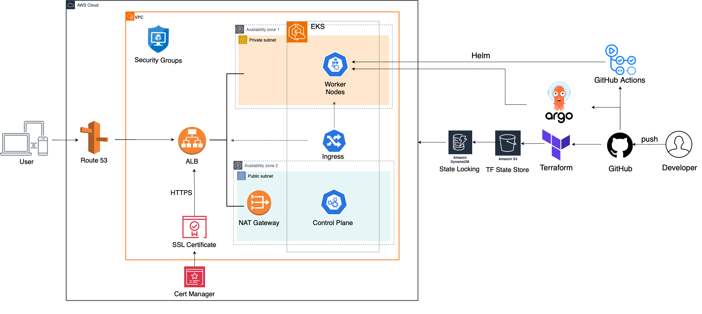
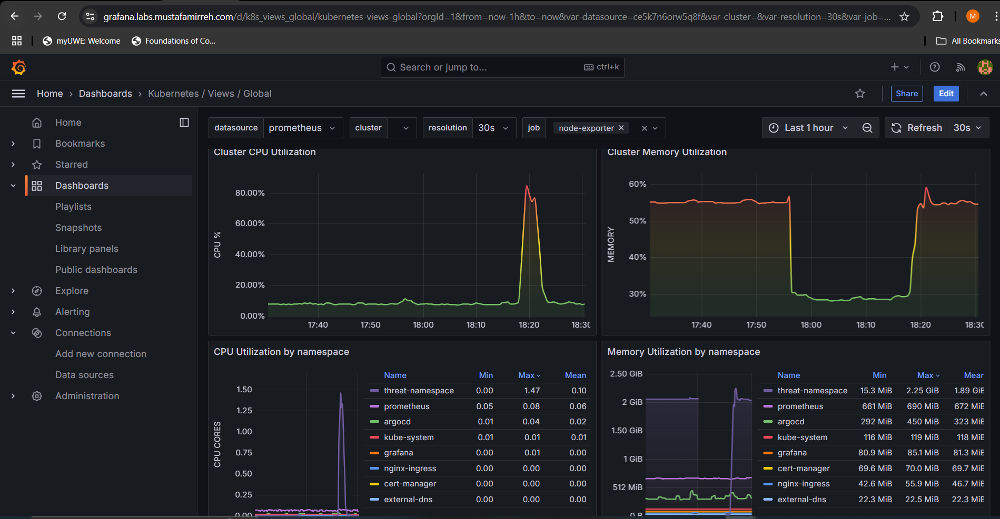
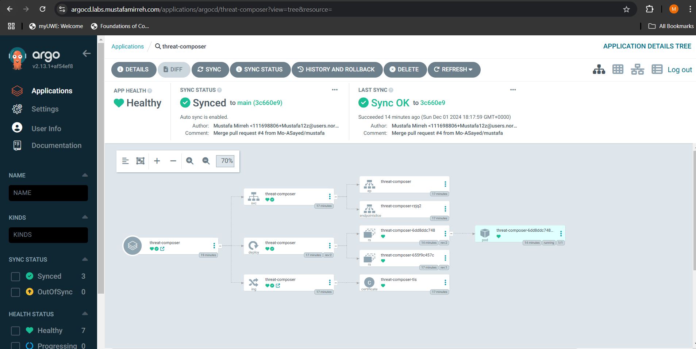

# Production-grade multi-app EKS deployment

This project focuses on deploying a fully containerised 2048 game application on AWS EKS (Elastic Kubernetes Service). The infrastructure is provisioned using Terraform for consistency and scalability. CI/CD pipelines have been implemented using GitHub Actions to automate the deployment process, and monitoring tools like Prometheus and Grafana are configured to provide real-time insights into application performance and infrastructure health.

## Tech Stack:
 
- **Kubernetes:** Orchestrates our containerised workloads for scalability and reliability.
- **ArgoCD:** Implementing GitOps for automated and declarative continuous delivery.
- **Prometheus:** Collects and queries app and infrastructure metrics for monitoring.
- **Grafana:** Visualises metrics and provides actionable insights through customised dashboards.
- **Docker:** Containerises the 2048 app to ensure a consistent runtime environment.

## Architecture diagram:

## Architecture
The deployment architecture is designed with scalability, reliability, and observability in mind. Here's a breakdown of the components:

1. **Route 53 and ALB**: DNS routing is handled via AWS Route 53, with HTTPS traffic secured using SSL certificates managed by cert-manager and terminated at an Application Load Balancer (ALB).
2. **EKS Cluster**: The application is hosted on an AWS EKS cluster, with worker nodes distributed across multiple availability zones for fault tolerance.
3. **GitOps with ArgoCD**: Continuous delivery is automated using ArgoCD, ensuring the Kubernetes cluster state reflects the desired state defined in Git repositories.
4. **Terraform**: Infrastructure provisioning and state management are fully automated using Terraform, with state locking enabled via DynamoDB and S3.
5. **Monitoring**: Prometheus collects detailed metrics, while Grafana visualises these metrics with customised dashboards for actionable insights.
6. **CI/CD Pipeline**: GitHub Actions automates application builds, containerisation (Docker), and deployments to EKS.

---

## Features

1. **Declarative Infrastructure**:
   - EKS clusters, security groups, and VPCs are provisioned with Terraform, ensuring consistency across environments.
   - Utilises S3 for Terraform state storage and DynamoDB for state locking to avoid conflicts in collaborative workflows.

2. **Automated Deployments**:
   - GitHub Actions pipelines automate application builds and deployments.
   - Integration with ArgoCD ensures seamless GitOps workflows for continuous delivery.

3. **Scalable and Secure Networking**:
   - DNS routing via Route 53 and HTTPS termination at ALB ensures secure communication.
   - Kubernetes ingress handles internal routing to services.

4. **Real-Time Monitoring**:
   - Prometheus scrapes metrics from both the app and infrastructure components.
   - Grafana dashboards provide detailed visualisation for proactive monitoring.

---

### Prometheus and Grafana Dashboard

Prometheus and Grafana are integrated into the deployment for real-time monitoring and observability of the Kubernetes cluster and applications.

- **Prometheus**: Used as the primary data collection and query backend. It scrapes metrics from Kubernetes components, application workloads, and infrastructure, providing detailed insights into resource usage and performance.
- **Grafana**: A visualisation tool layered on top of Prometheus, offering interactive dashboards and query options for monitoring cluster health, resource utilisation, and application performance.

#### Key Features:
- **Cluster Monitoring**: Dashboards include metrics like CPU utilisation, memory usage, and pod health across namespaces.
- **Custom Dashboards**: User-defined dashboards are set up for detailed application-specific monitoring.
- **Alerting**: Alerts can be configured in Prometheus and visualised in Grafana for proactive response to critical issues.

grafana dashboard

## ArgoCD
ArgoCD is used to implement a GitOps workflow, ensuring that the Kubernetes cluster state is always in sync with the desired state defined in Git repositories.

### Key Features:
- Automated Deployments: ArgoCD continuously monitors the Git repository for changes and applies them to the cluster. 
- Declarative Configuration: All resources, including deployments, services, and ingress rules, are defined as code in Git.
- Application Health Monitoring: The ArgoCD dashboard provides real-time application health and sync status, ensuring transparency and traceability.

